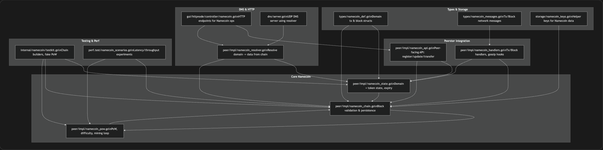

# Namecoin on Peerster – Project Kickoff

## 1. Goal & Scope

- Build a Namecoin-like decentralized naming system on top of Peerster.
- Use Peerster’s existing:
  - Gossip & routing (rumors, status, anti-entropy).
  - Data sharing (Bittorrent-style upload/download, naming store).
  - Consensus & blockchain (Paxos + TLC chain used today for file tags).
  - HTTP GUI & testing harness.
- Add:
  - A Namecoin-specific blockchain for domains, with Proof-of-Work (PoW).
  - Domain transactions (`name_new`, `name_firstupdate`, `name_update`, optional transfer).
  - Tokens for fees and miner rewards (simple fixed reward + flat fees).
  - Domain expiration + renewal and ownership change.
  - DNS-style resolution (`*.bit` → IP/data) via a resolver and DNS server.
- Non-functional goals:
  - System is robust against Byzantine attacks, including omission and equivocation.
  - System is robust against adversarial network conditions (delay, loss, partitions).
  - Performance measures:
    - Mining latency & throughput (blocks/s).
    - Name registration & update latency/throughput (tx/s).
    - Consensus and mining time vs number of nodes.
    - Network/bandwidth overhead for domain operations.

---

## 2. Existing System – Where We Plug In

**Gossip / Transport**

- `peer/impl/impl.go`: core `node` struct and `Start`/`Stop`, routing table, rumor tracking.
- `peer/impl/message_handlers.go`: handlers for:
  - `ChatMessage`, `RumorsMessage`, `StatusMessage`, `AckMessage`, `PrivateMessage`.
- `peer/impl/rumor_utils.go`, `anti_entropy.go`, `heartbeat_utils.go`, `routing.go`: dissemination logic.
- `transport/udp/udp.go`: UDP socket implementation.

**Data Sharing & Naming**

- `peer/impl/datasharing.go`: upload/download of blobs, chunk management, remote fetch via catalog.
- `peer/impl/catalog.go`: `Catalog` (key → peers that store it).
- `peer/impl/search.go`: search (searchAll/searchFirst) over naming store via search messages.
- `peer/impl/naming.go`: Tag/Resolve using Paxos + TLC blockchain (file-tag uniqueness).

**Consensus & Blockchain (Existing)**

- `types/consensus_def.go`, `types/consensus.go`: Paxos/TLC message types, `PaxosValue`, `BlockchainBlock`.
- `peer/impl/paxos.go`:
  - Paxos prepare/promise/propose/accept handlers.
  - TLC broadcast and `commitStepAndAdvance`.
  - `commitBlock`: stores `BlockchainBlock` and updates naming store.
- `storage/storage.go`: `Storage` abstraction and `GetBlockchainStore()`.

**HTTP GUI & Tooling**

- `gui/httpnode/httpnode.go`: HTTP proxy around a `peer.Peer`.
- `gui/httpnode/controller/blockchain.go`: current blockchain visualization.
- `gui/httpnode/controller/datasharing.go`, `messaging.go`, `service.go`, `socket.go`: existing endpoints.
- `polypus/polypus.go`: CLI harness that spins up multiple peers and lets us interactively chat/tag.

These will remain the foundation for Namecoin’s networking, persistence, and observability.

---

## 3. Planned Namecoin Modules & Architecture

### 3.1 High-Level Module List

**Types & Storage**

- `types/namecoin_def.go`
  - Domain transaction structs:
    - `NameNewTx` (salted domain hash + fee).
    - `NameFirstUpdateTx` (salt, cleartext name, value/IP + fee).
    - `NameUpdateTx` (new value/IP + fee).
    - Optional `NameTransferTx` (new owner + fee).
  - `DomainRecord` (owner, value, expiryHeight).
  - Namecoin block header/body:
    - Height, prevHash, txRoot, timestamp, nonce, miner, difficulty target.
  - Minimal token model:
    - Simple fixed block subsidy and per-tx fee fields.
    - Balances tracked per address (no complex wallet).

- `types/namecoin_messages.go`
  - Network messages implementing `types.Message`:
    - `NamecoinTxMessage` (carries one domain transaction).
    - `NamecoinBlockMessage` (carries a mined Namecoin block).

- `storage/namecoin_keys.go`
  - Constants and helpers for Namecoin data in `GetBlockchainStore()`:
    - `NamecoinLastBlockKey`.
    - `NamecoinBlockPrefix + <blockHash>`.
    - `NamecoinDomainIndexPrefix + <domain>`.
    - Any auxiliary indices needed for efficient reload.

**Core Chain & State**

- `peer/impl/namecoin_state.go`
  - In-memory and persisted state:
    - Domain map: `domain → DomainRecord{ owner, value, expiryHeight }`.
    - Account balances: `address → balance`.
    - Pending tx pool with bounds and simple anti-spam checks.
  - `ApplyTx(tx, height)`:
    - Validate:
      - Ownership and non-expiration for updates/transfers.
      - Domain is free or expired for `NameNew`/`FirstUpdate` as appropriate.
      - Flat fee ≥ minFee; sufficient balance for fees.
    - Update domain records and balances (fees + rewards are applied at block level).
  - Expiration handling:
    - At each new block height, drop or mark domains whose `expiryHeight < currentHeight`.
    - Allow re-registration of expired domains.

- `peer/impl/namecoin_chain.go`
  - Chain management:
    - `LoadNamecoinChain()` from `GetBlockchainStore()` at startup:
      - Replay blocks in order to rebuild `namecoin_state`.
    - `ValidateBlock(block)`:
      - Check prevHash linkage and monotonic height.
      - Verify txRoot consistency with included txs.
      - Use a copy of state to apply all txs via `ApplyTx`; reject on first failure.
    - `ApplyBlock(block)`:
      - Run `ValidateBlock`.
      - If valid and chain-preferred:
        - Update head pointer and persist block + `NamecoinLastBlockKey`.
        - Commit state changes and clear included pending txs.
    - Fork handling:
      - Simple “best chain by total work / cumulative difficulty” (or by height if difficulty is fixed).
      - Reorg mechanism:
        - Identify fork point.
        - Roll back to fork point by reloading from disk or replaying from genesis.
        - Apply blocks on the new best branch in order.

- `peer/impl/namecoin_pow.go`
  - Proof-of-Work:
    - Block header hashing (e.g. SHA-256 over header fields).
    - Difficulty target representation and `CheckWork(block, target)`.
    - Static per-run difficulty:
      - Target block interval ~5–10 seconds.
      - Configurable for tests (very low difficulty for unit tests).
    - `MineBlock(pendingTxs, prevHeader, target)`:
      - Select txs from pending pool.
      - Increment nonce until hash < target or stopping condition.
  - Mining loop:
    - Watches pending tx pool and chain head.
    - Starts mining candidate blocks when there is work.
    - On external better chain arrival:
      - Abort current mining and restart on new head.

**Peerster Integration**

- `peer/impl/namecoin_handlers.go`
  - Message callbacks registered in `impl.Start()`:
    - `NamecoinTxMessage`:
      - Validate tx structure and signatures (if any).
      - Reject malformed or conflicting txs without state changes.
      - Add valid txs to pending pool and gossip via `Broadcast`.
    - `NamecoinBlockMessage`:
      - Validate PoW, linkage, and txs via `ValidateBlock`.
      - If valid and improves best chain, call `ApplyBlock`.
      - Remove included txs from pending pool.
  - Deduplication / anti-spam:
    - Track seen tx and block IDs/hashes.
    - Bound pending pool size to avoid memory blowup in adversarial scenarios.

- `peer/impl/namecoin_api.go`
  - Node-facing API (used by tests, CLI, GUI, DNS):
    - `NameRegister(domain, salt, fee) (txID, error)` → broadcasts `NameNewTx`.
    - `NameFirstUpdate(domain, salt, value, fee) (txID, error)` → broadcasts `NameFirstUpdateTx`.
    - `NameUpdate(domain, value, fee) (txID, error)` → broadcasts `NameUpdateTx`.
    - `NameTransfer(domain, newOwner, fee) (txID, error)` (if implemented).
    - `NameLookup(domain) (DomainRecord, bool)` → reads from committed `namecoin_state`.
  - Hides tx construction (commit–reveal, fees) and broadcasting details from callers.

**DNS & HTTP / UX**

- `peer/impl/namecoin_resolver.go`
  - Read-only resolution API:
    - `ResolveDomain(name) (value string, ok bool)`:
      - Use current best chain height and `namecoin_state`.
      - Return no value for expired or never-registered domains.
    - Value interpretation:
      - If value parses as IP → produce A/AAAA DNS record.
      - Otherwise → produce TXT record (simple, enough for tests).

- `gui/httpnode/controller/namecoin.go`
  - HTTP endpoints for Namecoin operations (for demos / manual tests):
    - `POST /namecoin/name_new`.
    - `POST /namecoin/firstupdate`.
    - `POST /namecoin/update`.
    - `GET /namecoin/resolve?name=example.bit`.
    - `GET /namecoin/status` (height, difficulty, pending tx count).
  - Use `namecoin_api` and `namecoin_resolver`.

- `dns/server.go`
  - Simple UDP DNS server:
    - Listens on a configurable port.
    - For `*.bit` queries:
      - Calls `ResolveDomain`.
      - Returns A/AAAA or TXT records based on value.
    - Returns NXDOMAIN for unknown/expired domains.

**Testing, Robustness & Performance**

- `internal/namecoin/testkit.go`
  - Helpers for:
    - Creating valid/invalid transactions and blocks.
    - Building small chains and forks (including equivocation).
    - Simulating reorgs and adversarial blocks (bad PoW, invalid tx).
    - Configuring easy-difficulty mining for tests.

- `perf.test/namecoin_scenarios.go`
  - Benchmarks:
    - Mining latency vs difficulty and number of nodes.
    - Tx confirmation latency (register/update) vs load.
    - Consensus / convergence time vs number of nodes.
    - Network traffic vs number of domains and update rates.
  - Scenarios under:
    - Normal conditions.
    - Adversarial network (delays, losses) to see impact on performance.

- Test harness extensions:
  - Hooks to:
    - Drop or delay specific messages (omission/latency).
    - Partition the network temporarily.
    - Inject Byzantine behavior (equivocating miners, malformed messages).

### 3.2 Architecture Diagram (Mermaid)

---

# 4. Sprint Plan (3 Sprints)

## Sprint 1 – Core Chain, State & PoW Foundation

**Goal:** A validating, persistent Namecoin chain with PoW and domain/token state on honest nodes.

**Stories:**

- Types & storage
  - Implement `types/namecoin_def.go`, `types/namecoin_messages.go`, `storage/namecoin_keys.go` as described above.

- State & chain
  - Implement `peer/impl/namecoin_state.go`:
    - In-memory domain and balance maps.
    - `ApplyTx(tx, height)` with ownership/fee/expiry checks.
    - Pending tx pool with bounds.
  - Implement `peer/impl/namecoin_chain.go`:
    - `LoadNamecoinChain()` from `GetBlockchainStore()` at startup.
    - `ValidateBlock(block)` (no forks yet).
    - `ApplyBlock(block)`:
      - Persist blocks + last-head.
      - Update state and pending pool.

- PoW
  - Implement `peer/impl/namecoin_pow.go`:
    - Static, configurable difficulty with target 5–10s block time.
    - `CheckWork` and `MineBlock`.
  - Integrate with `node`:
    - `node` holds chain/state and (for now) can mine blocks locally.

- Basic tests
  - Unit tests:
    - Tx validation and state transitions (including expiry).
    - PoW hashing and difficulty check (with easy targets).
  - Integration tests:
    - Single-node chain growth and state reconstruction across restart.

**Deliverable:** Single node can mine and apply Namecoin blocks with PoW, maintain correct domain/token state, and recover from disk.

## Precise Tasks

### Types & Storage

- [ ] **S1-T1: Define Namecoin transaction types**
  - Add `NameNewTx`, `NameFirstUpdateTx`, `NameUpdateTx` (and optional `NameTransferTx`) to `types/namecoin_def.go`.

- [ ] **S1-T2: Define Namecoin block & domain structs**
  - Add `DomainRecord` and Namecoin block header/body (height, prevHash, txRoot, timestamp, nonce, miner, difficulty) to `types/namecoin_def.go`.

- [ ] **S1-T3: Implement Namecoin messages**
  - Add `NamecoinTxMessage` and `NamecoinBlockMessage` to `types/namecoin_messages.go` with `NewEmpty`, `Name`, `String`, `HTML`.

- [ ] **S1-T4: Define Namecoin storage keys**
  - Add `NamecoinLastBlockKey`, `NamecoinBlockPrefix`, `NamecoinDomainIndexPrefix` and helpers to `storage/namecoin_keys.go`.

---

### State & Chain

- [ ] **S1-T5: Implement in-memory Namecoin state**
  - In `peer/impl/namecoin_state.go`, add maps for `domain → DomainRecord` and `address → balance`, plus struct to hold them.

- [ ] **S1-T6: Implement ApplyTx(tx, height)**
  - In `namecoin_state.go`, validate ownership, fees, expiry and update domain/balance state for each tx type.

- [ ] **S1-T7: Implement pending tx pool**
  - In `namecoin_state.go`, add bounded pending tx pool (data structure + add/remove methods and basic anti-spam checks).

- [ ] **S1-T8: Implement LoadNamecoinChain()**
  - In `peer/impl/namecoin_chain.go`, load blocks from `GetBlockchainStore()` using Namecoin prefixes and rebuild state.

- [ ] **S1-T9: Implement ValidateBlock(block)**
  - In `namecoin_chain.go`, check prevHash, height, txRoot and replay txs on a temp state; return error on first violation.

- [ ] **S1-T10: Implement ApplyBlock(block)**
  - In `namecoin_chain.go`, call `ValidateBlock`, persist block and `NamecoinLastBlockKey`, commit state, and drop included pending txs.

---

### PoW

- [ ] **S1-T11: Implement PoW data structures**
  - In `peer/impl/namecoin_pow.go`, define difficulty representation and config parameters (target interval, easy-test mode).

- [ ] **S1-T12: Implement CheckWork(block, target)**
  - Hash block header and verify hash < target; return boolean/error.

- [ ] **S1-T13: Implement MineBlock(pendingTxs, prevHeader, target)**
  - Build candidate block from pending txs and increment nonce until `CheckWork` passes or stop condition.

- [ ] **S1-T14: Integrate chain/state/PoW into node**
  - Extend `node` struct to hold Namecoin chain/state/PoW config and initialize them in `impl.NewPeer`.

- [ ] **S1-T15: Add local mining entrypoint**
  - Add a method on `node` (e.g. `MineOneBlock()` or `StartLocalMining()`) that calls `MineBlock` and `ApplyBlock` on a single node (no gossip yet).

---

### Basic Tests

- [ ] **S1-T16: Unit tests for ApplyTx and state transitions**
  - Cover registration/update/expiry and balance updates in `namecoin_state_test.go`.

- [ ] **S1-T17: Unit tests for PoW hashing & difficulty**
  - Test `CheckWork` and `MineBlock` with very low difficulty in `namecoin_pow_test.go`.

- [ ] **S1-T18: Integration test – single-node chain growth**
  - Start a single node, mine a sequence of blocks with dummy txs, verify state progression and persisted blocks.

- [ ] **S1-T19: Integration test – restart & state reconstruction**
  - Mine blocks, stop node, restart from same storage, verify chain head, domain state and balances are identical.

---

## Sprint 2 – Name Operations, DNS Resolution & Multi-Node Robustness

**Goal:** Full domain lifecycle and DNS resolution across multiple nodes, robust to basic Byzantine inputs and churn.

**Stories:**

- Name operations API
  - Implement `peer/impl/namecoin_api.go`:
    - `NameRegister`, `NameFirstUpdate`, `NameUpdate`, optional `NameTransfer`, `NameLookup`.
    - Commit–reveal pattern for `name_new` + `name_firstupdate`.

- Expiration & ownership
  - Enhance `namecoin_state.go`:
    - Expiry tracking and enforcement.
    - Ownership changes on transfer.
    - Re-registration after expiry.

- Resolver & DNS
  - Implement `peer/impl/namecoin_resolver.go` (value → IP/TXT).
  - Implement `dns/server.go`:
    - UDP server using `ResolveDomain`.
    - A/AAAA/TXT mapping and NXDOMAIN for invalid/expired domains.

- Network integration
  - Implement `peer/impl/namecoin_handlers.go`:
    - Register `NamecoinTxMessage` and `NamecoinBlockMessage` handlers in `impl.Start()`.
    - Gossip txs via `Broadcast`.
    - Validate and apply blocks when received.
    - Deduplicate and bound pending txs.
  - Start mining loop on each node using existing transport.

- Robustness basics
  - Strict validation:
    - Reject malformed txs/blocks (bad PoW, invalid ownership, expired domains) with no side effects.
  - Churn:
    - Confirm that stopping/starting nodes preserves chain and domain state.

- Tests
  - End-to-end integration:
    - Register → firstupdate → update → resolve via DNS, across multiple nodes.
    - Domain expiration and re-registration.
    - Ownership transfer.
  - Churn tests:
    - Submit txs, mine blocks, restart nodes, confirm consistent state and DNS answers.

**Deliverable:** Multi-node network that supports end-to-end domain operations and DNS resolution, with correct behavior under node churn and malformed inputs.

---

## Precise Tasks

### Name Operations API

- [ ] **S2-T1: Define Namecoin API interface on node**
  - Add a `namecoin_api.go` file and decide receiver type (e.g., methods on `*node`).

- [ ] **S2-T2: Implement NameRegister (name_new)**
  - Construct `NameNewTx` from `(domain, salt, fee)`.
  - Compute salted hash for commit–reveal.
  - Broadcast as `NamecoinTxMessage`.

- [ ] **S2-T3: Implement NameFirstUpdate (name_firstupdate)**
  - Construct `NameFirstUpdateTx` from `(domain, salt, value, fee)`.
  - Validate commit–reveal linkage to corresponding `NameNewTx`.
  - Broadcast as `NamecoinTxMessage`.

- [ ] **S2-T4: Implement NameUpdate**
  - Construct `NameUpdateTx` for existing domain (new value + fee).
  - Enforce current-owner check in `ApplyTx`.
  - Broadcast as `NamecoinTxMessage`.

- [ ] **S2-T5: Implement optional NameTransfer**
  - Implement `NameTransfer(domain, newOwner, fee)` → `NameTransferTx`.
  - Ensure ownership moves to `newOwner` if tx is valid.

- [ ] **S2-T6: Implement NameLookup**
  - Add `NameLookup(domain) (DomainRecord, bool)` to read committed `namecoin_state`.

---

### Expiration & Ownership

- [ ] **S2-T7: Add expiry metadata to DomainRecord**
  - Extend `DomainRecord` with `expiryHeight` field and any constants for TTL.

- [ ] **S2-T8: Enforce expiry on ApplyTx**
  - In `ApplyTx`, reject operations on expired domains unless re-registration is allowed.
  - For registration, allow re-use only if domain is expired/freed.

- [ ] **S2-T9: Advance and prune expirations per block**
  - On each `ApplyBlock`, update current height and:
    - Remove or mark expired domains.
    - Ensure `NameLookup` and resolver ignore expired entries.

- [ ] **S2-T10: Enforce ownership changes in state**
  - On `NameTransferTx`, change `owner` in `DomainRecord`.
  - Ensure subsequent updates/transfer checks use new owner.

---

### Resolver & DNS

- [ ] **S2-T11: Implement namecoin_resolver.go**
  - Add `ResolveDomain(name) (value string, ok bool)` using `namecoin_state`.
  - Interpret value as:
    - IP → A/AAAA.
    - Other string → TXT (resolver returns the raw value; DNS layer maps to record types).

- [ ] **S2-T12: Implement DNS server skeleton**
  - Create `dns/server.go` with:
    - Configurable UDP port.
    - Handler that parses DNS queries and passes `qname` to `ResolveDomain`.

- [ ] **S2-T13: Map resolver output to DNS records**
  - For `ResolveDomain(name)`:
    - If `value` parses as IPv4/IPv6 → emit A/AAAA record.
    - Else → emit TXT record.
    - Return NXDOMAIN for `ok == false`.

- [ ] **S2-T14: Add start/stop hooks for DNS server**
  - Expose functions to start DNS server alongside nodes in tests or demos.

---

### Network Integration

- [ ] **S2-T15: Implement Namecoin Tx handler**
  - Add `handleNamecoinTx` in `peer/impl/namecoin_handlers.go`.
  - Register it for `NamecoinTxMessage` in `impl.Start()`.
  - Validate tx and add to pending pool; ignore duplicates.

- [ ] **S2-T16: Implement Namecoin Block handler**
  - Add `handleNamecoinBlock` in `namecoin_handlers.go`.
  - Register it for `NamecoinBlockMessage` in `impl.Start()`.
  - Validate PoW + linkage + txs; call `ApplyBlock` on success.

- [ ] **S2-T17: Integrate gossip for Namecoin messages**
  - Ensure `NamecoinTxMessage` and `NamecoinBlockMessage` use existing `Broadcast`/routing.
  - Respect deduplication to avoid floods.

- [ ] **S2-T18: Start mining loop on each node**
  - Add `StartNamecoinMining()` goroutine in `node.Start()` (or via config).
  - Use existing transport to broadcast newly mined blocks.

---

### Robustness Basics

- [ ] **S2-T19: Harden tx/block validation paths**
  - Ensure malformed txs/blocks (bad PoW, invalid ownership, expired domain, bad commit–reveal) are rejected with no state change.

- [ ] **S2-T20: Verify state persistence under churn**
  - Confirm that Namecoin state and chain are restored correctly after node restart (building on Sprint 1).

---

### Tests

- [ ] **S2-T21: End-to-end test – domain lifecycle (multi-node)**
  - Scenario:
    - Node A registers domain, does firstupdate and update.
    - Other nodes resolve via DNS and `NameLookup`.
    - Check consistency across all nodes.

- [ ] **S2-T22: End-to-end test – expiration & re-registration**
  - Mine enough blocks to expire a domain.
  - Verify DNS resolution stops.
  - Re-register the same name and verify new value is visible.

- [ ] **S2-T23: End-to-end test – ownership transfer**
  - Transfer domain from owner A to B.
  - Verify only B can issue subsequent updates.

- [ ] **S2-T24: Churn test – restart nodes**
  - Perform operations, mine blocks, then stop/restart a subset of nodes.
  - Verify:
    - Chains converge.
    - `NameLookup` and DNS resolution are identical across nodes.

## Sprint 3 – Byzantine Robustness, Adversarial Networks & Performance

**Goal:** Demonstrate robustness against Byzantine attacks (including omission and equivocation) and adversarial network conditions, and collect performance metrics.

**Stories:**

- Byzantine robustness

  - Equivocation:
    - Use `internal/namecoin/testkit.go` + harness to:
      - Construct scenarios where a malicious miner creates two different blocks at the same height and sends them to different subsets.
    - Verify:
      - Deterministic fork-choice (longest chain / most work).
      - Honest nodes converge to a common head after messages propagate.
      - Invalid or conflicting blocks are rejected and do not alter state.

  - Omission / withholding:
    - Simulate dropped txs/blocks or nodes that never broadcast their blocks.
    - Ensure:
      - Honest nodes still converge when messages eventually flow.
      - Late-arriving blocks are correctly integrated or discarded based on fork-choice.

  - Malformed data:
    - Inject blocks/txs with:
      - Bad PoW.
      - Invalid domain operations (wrong owner, insufficient fee).
      - Corrupted payloads.
    - Confirm state remains consistent and DNS answers never reflect invalid data.

- Adversarial network conditions

  - Network simulations via test harness:
    - Add delay and jitter to message delivery.
    - Introduce packet loss and temporary network partitions.
  - Scenarios:
    - Two partitions mining independently; then reconnect.
    - High loss on gossip channels.
  - Verify:
    - No state corruption.
    - Eventual convergence on a single chain and consistent domain view/DNS.

- Performance evaluation

  - `perf.test/namecoin_scenarios.go`:
    - Mining throughput:
      - Blocks/s under varying difficulty and node counts.
    - Domain operation throughput:
      - Tx/s for registration and updates.
      - Latency from tx submission to k confirmations.
    - Consensus vs number of nodes:
      - Time for nodes to agree on new head after block creation.
    - Network overhead:
      - Measure gossip traffic and DNS traffic as domains and update rates grow.
      - Compare normal vs adversarial network conditions.

- UX / API for experiments

  - CLI (Polypus) integration:
    - Scripts or commands to trigger bursts of registrations/updates.
    - Tools to control difficulty and node counts.
  - HTTP and DNS endpoints:
    - Used for demos and a small subset of end-to-end experiment validation.

**Deliverable:** Evidence (tests + metrics) that the system:

- Is robust against Byzantine attacks, including omission and equivocation.
- Is robust against adversarial network conditions.
- Meets the project’s performance evaluation requirements (with quantified results).

## Precise Tasks

### Byzantine Robustness

- [ ] **S3-T1: Extend Namecoin testkit for adversarial blocks**
  - In `internal/namecoin/testkit.go`, add helpers to build conflicting blocks at the same height with chosen tx sets.

- [ ] **S3-T2: Equivocation scenario – conflicting blocks**
  - Write an integration test where a malicious miner produces two valid blocks at the same height and sends each to a different subset of nodes.
  - Assert deterministic fork-choice (longest chain / most work) and eventual convergence on a common head.

- [ ] **S3-T3: Verify state stability under equivocation**
  - In the equivocation test, verify that:
    - State updates follow only the selected chain.
    - DNS resolution and `NameLookup` reflect the final winning block only.

- [ ] **S3-T4: Omission/withholding scenario – missing broadcasts**
  - Implement a test where some nodes mine blocks but do not broadcast them immediately (or drop txs).
  - Release withheld blocks later and ensure fork-choice handles late arrivals correctly.

- [ ] **S3-T5: Validate convergence after omission**
  - In the omission tests, assert that all honest nodes converge to the same head once all messages are ultimately delivered.

- [ ] **S3-T6: Malformed block scenarios**
  - Use testkit to generate blocks with:
    - Invalid PoW.
    - Invalid domain ops (wrong owner, insufficient fee, expired domain).
    - Corrupted payloads (bad fields).
  - Confirm they are rejected without side effects on state or DNS.

---

### Adversarial Network Conditions

- [ ] **S3-T7: Add network fault injection hooks to harness**
  - Extend the test harness to support:
    - Per-link delay and jitter.
    - Configurable packet loss.
    - Temporary partitions (groups of nodes disconnected).

- [ ] **S3-T8: Partition scenario – independent mining and reconnection**
  - Create a test where the network splits into two partitions that mine independently, then reconnect.
  - Verify fork-choice and eventual convergence on a single chain and consistent domain view/DNS.

- [ ] **S3-T9: High-loss gossip scenario**
  - Run a scenario with high packet loss on gossip channels.
  - Ensure no state corruption and eventual agreement given enough time.

- [ ] **S3-T10: DNS consistency under adversarial network**
  - In the above scenarios, explicitly check that DNS responses (via `dns/server.go`) are consistent across nodes after convergence.

---

### Performance Evaluation

- [ ] **S3-T11: Implement perf.test scaffolding**
  - Create `perf.test/namecoin_scenarios.go` with a harness to:
    - Start N nodes.
    - Configure difficulty and network shape.
    - Drive scripted workloads (registrations, updates).

- [ ] **S3-T12: Measure mining throughput**
  - Scenario:
    - Vary difficulty and number of nodes.
    - Measure blocks/s and time to first block.
  - Record results for report.

- [ ] **S3-T13: Measure domain operation throughput & latency**
  - Scenario:
    - Submit a stream of registration/update txs.
    - Measure tx/s and latency from submission to k confirmations.

- [ ] **S3-T14: Measure consensus convergence vs node count**
  - Scenario:
    - Vary number of nodes (e.g., 4, 8, 16).
    - Measure time for all nodes to agree on new head after each block.

- [ ] **S3-T15: Measure network overhead**
  - Instrument gossip and DNS layers to count bytes/messages.
  - Vary:
    - Number of domains.
    - Update rate.
    - Network conditions (normal vs adversarial).
  - Export metrics for analysis.

---

### UX / API for Experiments

- [ ] **S3-T16: Polypus CLI scripts for load generation**
  - Add commands or scripts to Polypus to:
    - Trigger bursts of registrations/updates.
    - Adjust difficulty and node count per run.

- [ ] **S3-T17: Experiment orchestration helpers**
  - Provide simple scripts or documentation to:
    - Set up test topologies.
    - Run performance scenarios with consistent parameters.

- [ ] **S3-T18: Demo flows via HTTP and DNS**
  - Prepare a small set of demo scenarios that:
    - Use HTTP endpoints for visibility.
    - Use DNS queries to show Namecoin-based resolution under normal and stressed conditions.

## Archtectural Decisions Made  
### 1. Difficulty & Block Time

Target interval: ~5–10 seconds per block, configurable per test.

Fast enough to observe many blocks for throughput/latency metrics.
Slow enough that forks under normal conditions are visible but not constant noise.
For some unit tests (especially PoW logic), allow a “test difficulty” mode with extremely easy targets to keep tests fast.
Difficulty policy: static per run (no automatic retarget), but exposed via config.

For performance tests: you can set a “normal” difficulty and measure blocks/sec vs number of nodes.
For PoW tests: you can lower difficulty so you don’t wait long.
For robustness tests (omission/equivocation/adversarial network): keeping difficulty static removes one variable, so you can attribute behavior to the network/Byzantine patterns rather than difficulty oscillations.
Dynamic difficulty doesn’t add much to those specific test goals and complicates reasoning about convergence.
### 2. Tokenomics

Block reward: fixed constant reward.

Easy to reason about in tests: balances grow linearly with number of blocks.
Lets you check that rewards are correctly assigned and persist across restarts without introducing time‑dependent policies.
Fees: simple, low flat fee per operation (possibly zero in some tests).

Keeps tx validation transparent: unit tests can assert “this tx must be rejected because fee < minFee” if you decide to enforce one.
For most end‑to‑end and adversarial tests, you can ignore economics and concentrate on correctness:
Ownership changes, expiration, and DNS mapping don’t require a sophisticated fee model.
A complex fee market or decaying rewards mainly adds edge cases but doesn’t help with the listed behaviors.
### 3. DNS Mapping

On‑chain value model: single string payload per domain, interpreted minimally.

If it parses as an IP address → respond as A/AAAA.
Else → respond as TXT.
This is enough to test:
End‑to‑end DNS resolution (domain → IP).
That conflicting/invalid on‑chain data from Byzantine blocks is rejected or ignored when the block fails validation.
Multi‑record & rich schemas: optional, not core.

For the specified tests, what matters is that:
Correct registrations resolve.
Updates override older values.
Expired domains stop resolving.
Malicious data in invalid blocks does not leak into the resolver state.
You can keep encoding simple and still inject adversarial cases by crafting invalid blocks (bad signatures, wrong PoW, conflicting txs) rather than relying on exotic record formats.
### 4. Security Model

Baseline assumption: majority honest hash power, but explicit adversarial test scenarios.

Core design targets the “honest majority” case so performance and normal behavior are clean.
For robustness tests, you deliberately violate assumptions locally (per test) to exercise code paths:
Omission: simulate dropped blocks/txs (e.g., a test harness that selectively filters gossip) and verify eventual reconvergence once messages flow again.
Equivocation: have a Byzantine miner create two blocks at the same height with same/overlapping txs and broadcast to different subsets; verify fork choice (heaviest/longest chain) and eventual agreement.
Adversarial network conditions: inject delays and temporary partitions in the test harness; check that nodes do not accept invalid PoW/txs and do converge once the network heals.
Design implications:

Fork-choice rule should be deterministic and simple (e.g., longest chain / most cumulative work).
Block and tx validation must be strict and side‑effect free on failure, so adversarial inputs can’t corrupt state even when network is hostile.
Persistence layer must be robust so that after churn/restarts, nodes reconstruct the same state from disk and then converge on the same chain when they reconnect.
### 5. UX & API Priorities (with tests in mind)

Top priority: internal Go API + scripted tests / Polypus.

Most of your required tests are easier as automated integration tests:
End‑to‑end registration → update → expiration → ownership change.
PoW and block validation.
Persistence under churn (stop/start nodes and check state).
Byzantine scenarios and adversarial networks (controlled via harness).
These are best driven by code, not manually via GUI.
Second priority: DNS resolver + minimal DNS server.

For “Namecoin-based DNS resolution” tests, you need:
A resolver API in Go for unit/integration tests.
A thin DNS server layer to show that real DNS queries are correctly answered.
Tests can call the resolver directly, and only a few end‑to‑end tests need to go through the UDP server.
Third priority: HTTP GUI.

Great for demos and manual exploratory testing (visualizing chain, domains, etc.).
Not strictly necessary to satisfy the specified automated tests, so you can implement it once core and DNS components are stable.

